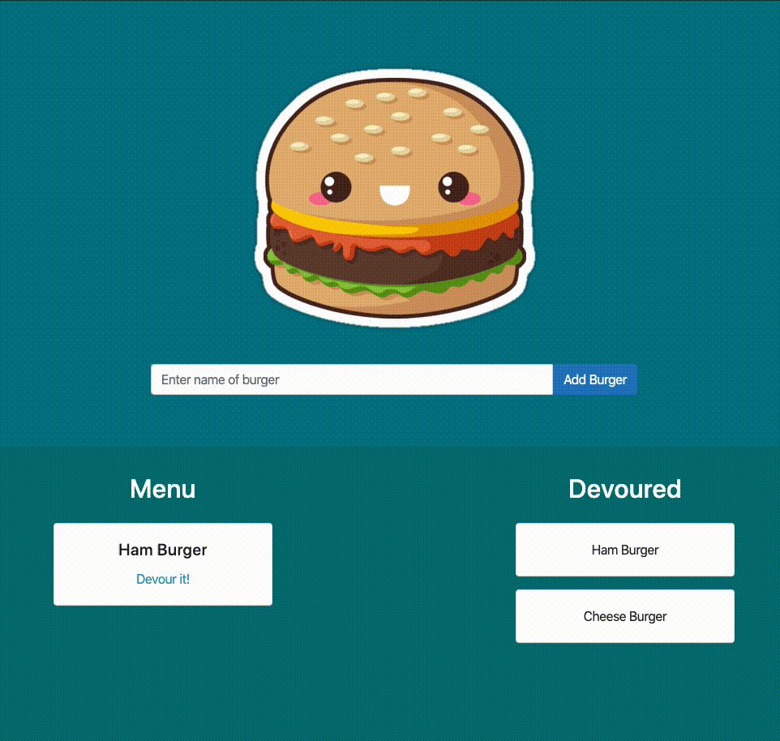

# BURGER

A simple app where you can add burgers to a list and devour those burgers with a click of a button.

This app runs on `express`, `express-handlebars`, and `mysql` Node.js modules.

# Preview

Check it out here for yourself ---> **[LIVE DEMO](https://burger-eat-me.herokuapp.com/)**

# Installation

Note.js v13+ and MySQL v8+ are required in order to run this script.

1. Download or clone this repository into your local computer.
2. Log into your MySQL server and run the SQL files `./db/schema.sql` and `./db/seeds.sql` to initialize the database.
3. Edit the `./config/connection.js` file with your own credentials so the app can connect to your MySQL server.
4. In your terminal, browse to the folder and run `npm install`.

# Usage

1. In your terminal, run the script with the command `node server`. This will run a local server that hosts the web app on port 8000.
2. Visit `http://localhost:8000` to access the web app.
3. Add a burger with a name of your choice.
4. Click on the Devour it! button beneath the burger to devour it!

# 
